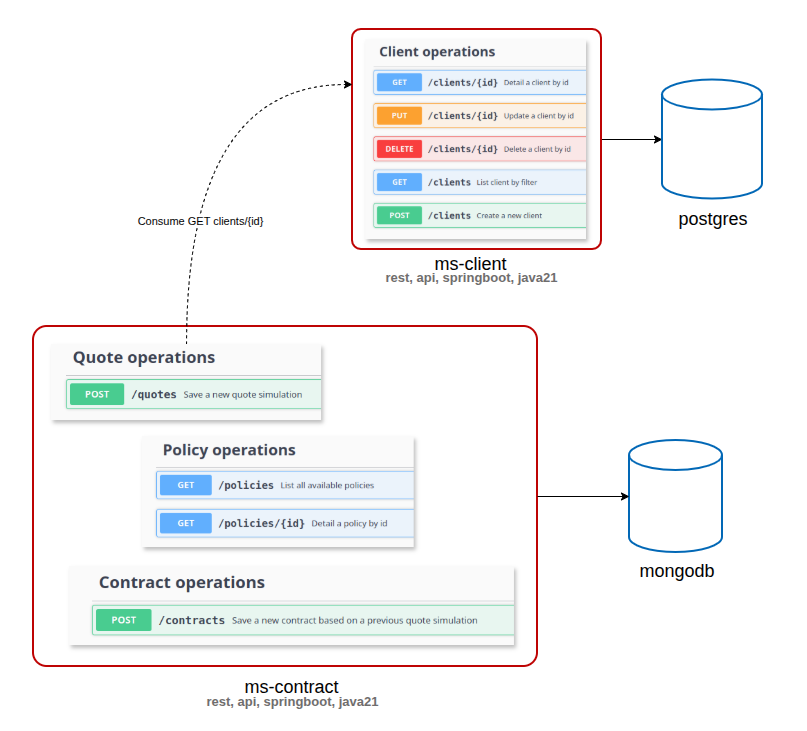

# Simple Hexagonal Arch for rest api

## Component Archtecture



## Source File Archtecture

```sh
./ms-contract
   ├── src/demo/contract
   │        │
   │        ├── adapter
   │        │   ├── config
   │        │   │   ├── BeanInjectionConfiguration.java
   │        │   │   └── GlobalExceptionHandler.java
   │        │   ├── controller
   │        │   │   ├── ContractController.java
   │        │   │   ├── PolicyController.java
   │        │   │   └── QuoteController.java
   │        │   ├── integration
   │        │   │   ├── ClientService.java
   │        │   │   └── RiskAnalisisServiceFake.java
   │        │   └── repository
   │        │       ├── ContractDocument.java
   │        │       ├── ContractRepositoryMongo.java
   │        │       ├── PolicyRepositoryCatalogFake.java
   │        │       ├── QuoteDocument.java
   │        │       └── QuoteRepositoryMongo.java
   │        │
   │        └── application
   │            ├── exception
   │            │   ├── InternalErrorException.java
   │            │   ├── InvalidRequestException.java
   │            │   └── ResourceNotFoundException.java
   │            ├── gateway
   │            │   ├── ClientServiceGateway.java
   │            │   ├── ContractRepositoryGateway.java
   │            │   ├── PolicyRepositoryGateway.java
   │            │   ├── QuoteRepositoryGateway.java
   │            │   └── RiskAnalisisServiceGateway.java
   │            ├── model
   │            │   ├── ClientModel.java
   │            │   ├── ContractModel.java
   │            │   ├── CoverageModel.java
   │            │   ├── PolicyModel.java
   │            │   └── QuoteModel.java
   │            └── service
   │                ├── CreateContractService.java
   │                ├── CreateQuoteService.java
   │                ├── GetPolicyByIdService.java
   │                └── ListPolicyService.java
   │ 
   ├── src-r/application.properties
   │ 
   └── tst/demo/contract/application/service
                       │
                       ├── CreateContractServiceTest.java
                       └── ServiceFixture.java

./ms-client
    ├── src/demo/client
    │        │
    │        ├── adapter
    │        │   ├── config
    │        │   │   ├── BeanInjectionConfiguration.java
    │        │   │   └── GlobalExceptionHandler.java
    │        │   ├── controller
    │        │   │   └── ClientController.java
    │        │   └── repository
    │        │       ├── ClientEntity.java
    │        │       └── ClientRepositoryJPA.java
    │        │
    │        └── application
    │            ├── exception
    │            │   ├── InternalErrorException.java
    │            │   ├── InvalidRequestException.java
    │            │   └── ResourceNotFoundException.java
    │            ├── gateway
    │            │   └── ClientRepositoryGateway.java
    │            ├── model
    │            │   └── ClientModel.java
    │            └── service
    │                ├── CreateClientService.java
    │                ├── DeleteClientByIdService.java
    │                ├── GetClientByIdService.java
    │                ├── ListClientService.java
    │                └── UpdateClientByIdService.java
    │
    ├── src-r/application.properties
    │   
    └── tst/demo/client/application/service
             │  
             ├── ClientServiceFixture.java
             ├── CreateClientServiceTest.java
             ├── DeleteClientByIdServiceTest.java
             ├── GetClientByIdServiceTest.java
             ├── ListClientServiceTest.java
             └── UpdateClientByIdServiceTest.java

```


